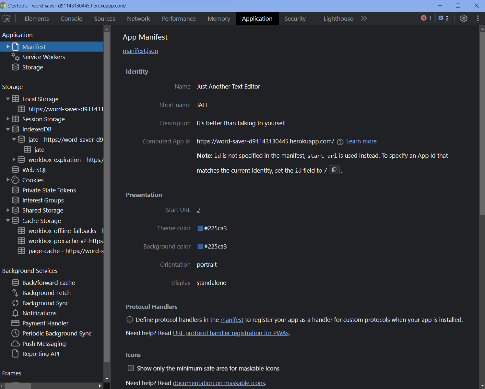
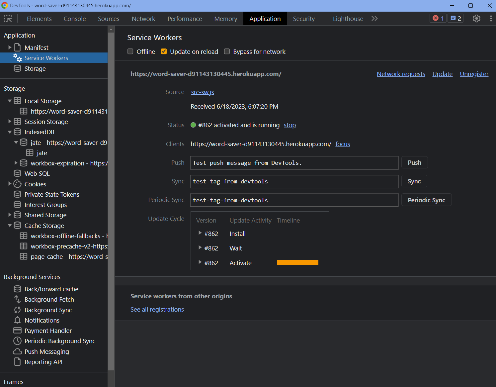

  # Text-Editor Application
  
  ## Description
  This application is intended to allow an individual to create notes with or without an internet connection to be reliably retrieved when needed. This project was developed as a requirement of the Berkeley Fullstack Flex Web Development coding bootcamp.
  
  ## Table of Contents
  
  * [Technologies_Used](#technologies-used)
  * [Installation](#installation)
  * [Preview](#preview)
  * [Usage](#usage)
  * [Credits](#credits)
  * [Tests](#tests)
  * [License](#license)
  * [Questions](#questions)
  
  ## Technologies Used
  - JavaScript
  - Node.js v18.12.1
  - Express.js
  - Webpack
  - Workbox Service Worker
  - Babel

  
  ## Installation
  You may access the application [here](https://word-saver-d91143130445.herokuapp.com/). Click the `Install Me!` button to install the application for offline use.
  
  ## Preview
  

  

  

  
  ## Usage
  - On the Application landing page, click the "Install Me!" button to download the application as an icon to your desktop.
  
  ## Credits
  Source code provided by UC Berkeley Fullstack Flex Web Development coding bootcamp.
  Coding haiku shown in [Preview](#preview) sourced from Ian Johnson [here](https://dev.to/ben/give-me-your-best-programming-haiku-54db#comment-32jk).
  
  ## Tests
  N/A
  
  ## License
  This project is licensed under the MIT License - see Badge link for details.
  
  ## Questions
  If you have any questions or issues with the repo, please reach out to "[sarah-jensen]("https://github.com/sarah-jensen")" or create an issue in the "["repo"](https://github.com/sarah-jensen/text-editor)".